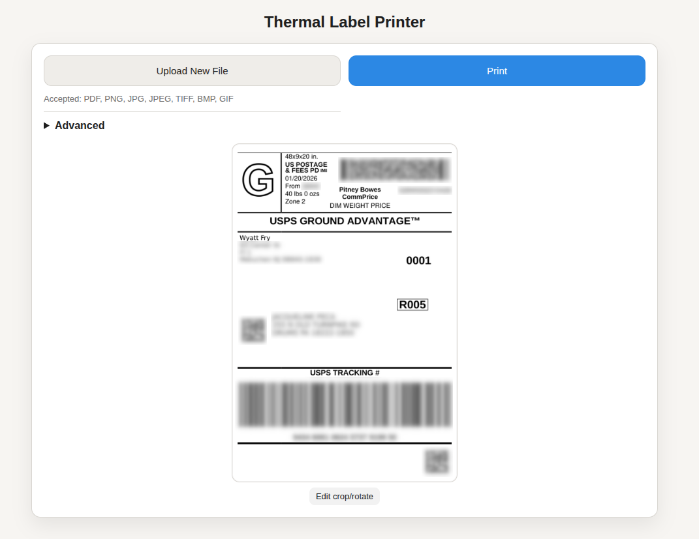

# Thermal Label Printer Web Interface

This Windows Python/Flask app hosts a web page where users can upload files and print 4x6 labels to a USB thermal printer. Tested with the Vretti 420B. It includes auto-crop/auto-rotate for PDFs, a preview step, and a manual crop/rotate editor.



## Prerequisites

- Windows 10/11
- Python 3.9+
- Microsoft Visual C++ Redistributable (required by some PDF/rendering libraries)

Python packages (auto-installed via `pip install -r requirements.txt`):
- Flask (required)
- Pillow (required for image processing and manual edit UI)
- PyMuPDF (required for PDF processing)

**SumatraPDF:** The app automatically downloads and uses SumatraPDF 3.5.2 (portable version) on first run. No manual installation needed.

## Install

1. Create and activate a virtual environment (recommended):
   ```shell
   python -m venv venv
   .\venv\Scripts\activate
   ```

2. Install Python dependencies:
   ```shell
   python -m pip install -r requirements.txt
   ```

## Configure

Edit `server/settings.py` to customize:
- `PRINTER`: Windows printer name (required for printing)
- `PRINT_SETTINGS`: SumatraPDF print settings string (default: `"fit,portrait,paper=4x6"`)
- `LABEL_DPI`: Label DPI (default: `203`)
- `LABEL_SIZE_IN`: Label dimensions in inches (default: `(4, 6)`)

Uploads and logs are stored in:
- `{app_dir}/uploads/`
- `{app_dir}/logs/`

Where `{app_dir}` is the directory containing the `server/` package.

## Run

```shell
python app.py
```

Open `http://localhost:8088` in your browser.

On first run, the app will automatically download SumatraPDF (~50 MB) and extract it to `.sumatrapdf/` (git-ignored). Subsequent runs use the cached version.

## Notes

- PDFs are rasterized with PyMuPDF; images are processed with Pillow.
- Multi-page PDFs are rendered page-by-page.
- If PDF processing fails, check `{app_dir}/logs/label-upload.log`.
- Service logs are written to `{app_dir}/logs/service.log`.

## Windows Service

The app can run as a Windows service (auto-start on boot). For service support, install `pywin32` (included in requirements.txt)

Use `service.ps1` to manage the app as a Windows service. Run these commands from an elevated PowerShell window. The service uses the global Python 3.11 selected by `py.exe`; the project virtual environment remains suitable for manual runs and tests.

```powershell
# install or repair (auto-start)
.\service.ps1 -install -PythonExe "py.exe"

# start / stop
.\service.ps1 -start
.\service.ps1 -stop

# enable / disable auto-start
.\service.ps1 -enable
.\service.ps1 -disable

# uninstall
.\service.ps1 -uninstall

# status
.\service.ps1 -status
```

## License

This project uses SumatraPDF, which is licensed under GPL v3. See [SumatraPDF](https://www.sumatrapdfreader.org/) for details.
